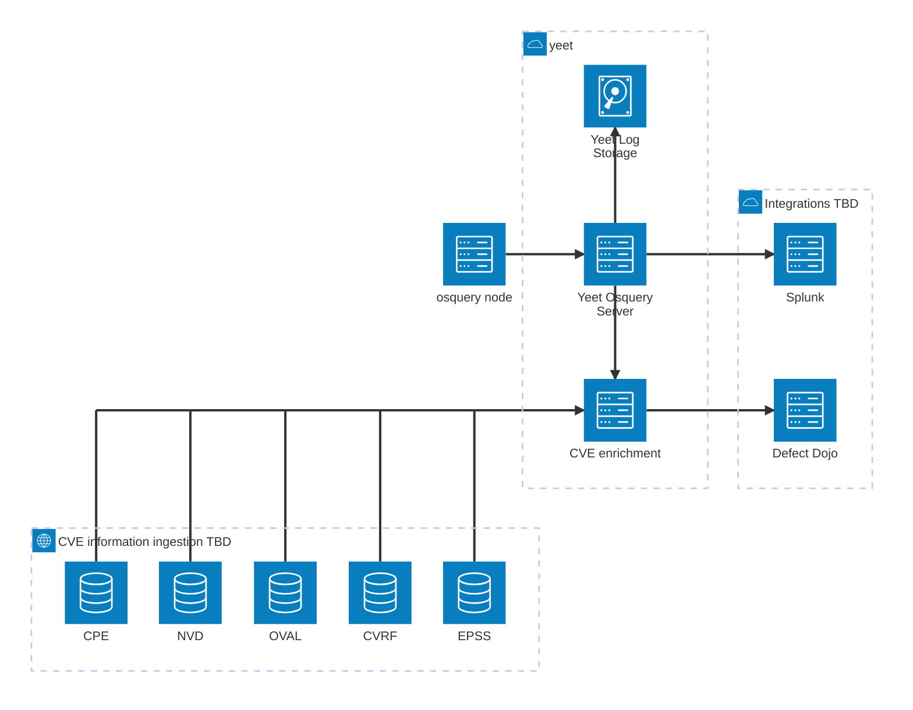

# osquery

## Intro to osquery

Osquery (https://osquery.io/) is a tool that allows to query information about an device in an relational-data model way. Osquery is however only the tool / daemon that runs on the device. Extraction of this information is possible in multiple ways:

- logs forwarder to e.g. splunk
- osquery extension
- osquery remote api (tls extension)

The logs forwarding option is the most secure one - with the huge downside that you are not able to run distributed queries and have to make an config deployment each time you want to change a scheduled query.

If you want to use osquery as an investigation tool / run information collection in an interactive way you either have to develop a new extension or use the remote api.
To orchestrate all the nodes (hosts) you need a central server which implements the remote api. This design document describes this remote api implementation in yeet. To see possible alternative implementations see [Alternative remote api implementations](#alternative-remote-api-implementations)

## Quick overview



## Possible use-cases

The integration of osquery into yeet opens many possibilities for yeet:

- Displaying more information about a host (in yeet)
- Investigate a host with `yeet query`
- Create warnings on queries e.g. if space is running out | as alternative to e.g. checkmk

The biggest improvement will however be for your specififc use-case. The osquery information can be forwarded to your SIEM and then used to enrich your detection / alerts:

- "real"-time sofware inventory
- integrate osquery data into checkmk
- CVE scanning on installed packages
- Windows Registry tests
- Windows GPO tests

## Alternative remote api implementations

Note: this is at the time of writing (03.2026). This is in no way a representative sample nor the opinion of yeet. This is a highly subjective view and is not meant derogatory.

### TrendAI integration

TrendAI has a basic integration altough it is hard to use in the UI and currently 14! versions out of date. There is no easy

### osctrl

Good initial idea and also has gained some more traction recently but is still very WIP. Deployment is a nightmare and not good documented.

### Wazuh

_Untested_
Documentation could be improved. If you already use Wazuh definitely go with it. If not this may be a a big dependency to use for osquery.
Like shooting on pigeons with canons.

### Elastic Security

_Untested_
Seems to be a very good integration. If you already have Elastic go for it. Unfortunately, not open source.

## Goals

- Implement the osquery remote deployment https://osquery.readthedocs.io/en/latest/deployment/remote/
- Be able to run yeet only as a osquery remote
- Run distributed osquery
- Support file carving
- Support scheduled queries

## Integration into yeet

All Api request / responses are implemented in an independant `osquery-rs` crate to allow other crates to easy implement the api.

### Permissions

### API Design

The following apis map to the osquery flags:

```
enroll_tls_endpoint = "/osquery/enroll";
config_tls_endpoint = "/osquery/config";
logger_tls_endpoint = "/osquery/log";
distributed_tls_read_endpoint = "/osquery/query/read";
distributed_tls_write_endpoint = "/osquery/query/write";
carver_start_endpoint = "/osquery/carver/init";
carver_continue_endpoint = "/osquery/carver/block";
```

## Splunk logs forwarding

Yeet has a native integration to forward osquery logs to splunk. Currently only distributed queries are available.
To connect to splunk the HEC connection is used. Configure it with:

- YEET_SPLUNK_INDEX: name of the index it should load the data into
- YEET_SPLUNK_URL: the url to your splunk server ending in `services/collector/event`
- YEET_SPLUNK_TOKEN: Splunk auth token so that yeet can send the data

TODO: document the different types of events

#### Enrollment

The osquery client provides an enroll secret set with `enroll_secret_path`.
Yeet expects the client to supply the content defined in the yeet secret called `osquery-enroll`.
This secret has to be create via `yeet secret add`. The content is completely arbitrary.
Once a node is enrolled it can not be removed by changing the yeet secret.
The node is free to use any `host_identifier` as long as it is UNIQUE for all nodes.

The response from the server responds with an UUIDv4 `node_key`.

### Client Configuration

## Future Work

- integrate a cve scanning (kepler) into yeet so that you can find cves in osquery
- osquery extension
